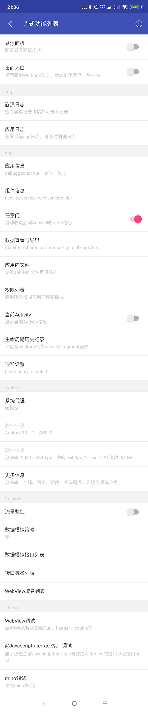

## Requirements

Android 4.4+ (API level 19+)


如果想在低版本中使用workbox，请在Manifest.xml中添加如下代码:

```
<uses-sdk tools:overrideLibrary="com.su.workbox" />
```

部分功能在低版本手机中将无法使用


## Workbox

```groovy
debugApi 'com.su:workbox.annotations:0.9.5'
debugAnnotationProcessor 'com.su:workbox.compiler:0.9.5'
debugImplementation 'com.su:workbox:0.9.5'
releaseImplementation 'com.su:workbox-no-op:0.9.5'

```

需要将module名称传给compiler

```groovy
defaultConfig {
    ...
    javaCompileOptions {
        annotationProcessorOptions {
            arguments = [MODULE_NAME: project.getName()]
        }
    }
}
```

您可以通过实现自己的`com.su.workbox.WorkboxSupplier`来改变策略。

初始化workbox

```java
private static void initWorkbox(Application application) {
    Workbox.init(application);
}
```

或者
```java
private static void initWorkbox(Application application, String className) {
    Workbox.init(application, "您的WorkboxSupplier类名");
}
```

用户若有自定义相关信息，需要继承`WorkboxSupplier`重写相关方法，并使用其初始化`Workbox`。


监听activity/fragment生命周期

如果只想监听activity生命周期，初始化Workbox之后无需做额外的任何事情即可在`生命周期历史记录`中看到activity生命周期记录，如果想记录fragment生命周期，则需在您的BaseFragment的`onAttach`方法中调用

```
Workbox.registerFragment(this)
```

由于生命周期记录是存储在数据库中的，所以需要您定期手动清理。


收集崩溃日志

需要将CrashLogHandler设置为DefaultUncaughtExceptionHandler

```java
if (BuildConfig.DEBUG) {
    Thread.setDefaultUncaughtExceptionHandler(Workbox.newLogUncaughtExceptionHandler(true));
}
```

或者，在您的UncaughtExceptionHandler中调用CrashLogHandler其`uncaughtException`方法

根据需要设置是否杀死进程

由于崩溃日志是存储在数据库中的，所以需要您定期手动清理。普通日志并没有存在数据库中，无需特殊处理。


使用任意门功能时，可以使用NoteComponent注解对activity进行如下类似Intent参数配置

```java
@NoteComponent(description = "页面传参测试",
        type = "activity",
        parameters = {@Parameter(parameterName = "object", parameterClass = ObjectParameter.class, parameterRequired = false),
                @Parameter(parameterName = "objects", parameterClass = ObjectParameter[].class, parameterRequired = false),
                @Parameter(parameterName = "int", parameterClass = int.class),
                @Parameter(parameterName = "long", parameterClass = long.class, parameterRequired = false)})
```

其中`type`必须要指定为`activity`，参数不仅可以配置为基本数据类型也可以配置实现Parcelable的类型。

也可通过修改Workbox自动收集的Intent信息进行跳转，Workbox默认收集用户在打开页面时的Intent信息。


其中`getRequestBodyExcludeKeys`是下文提到的过滤特定的请求字段。

> {
> ​	"body": {
> ​		"random": "abc"
> ​	},
> ​	"traceId": "efg"
> }

例如，当您想过滤请求体中body字段下的random字段和traceId字段时，需要按如下格式覆盖此函数：

```java
@NonNull
@Override
public List<List<String>> getRequestBodyExcludeKeys() {
    List<List<String>> keys = new ArrayList<>();
    List<String> random = new ArrayList<>();
    random.add("body");
    random.add("random");
    keys.add(random);
    List<String> traceId = new ArrayList<>();
    traceId.add("traceId");
    keys.add(traceId);
    return keys;
}
```

在使用域名切换时，可以覆盖`urlMapping`来实现自己的url映射策略

`Network`中，部分功能需要配合OkHttp一起使用，可以给OkHttp添加如下拦截器

```java
builder.addInterceptor(Workbox.getHostInterceptor());
builder.addInterceptor(Workbox.getMockInterceptor());
builder.addInterceptor(Workbox.getDataCollectorInterceptor());
builder.addInterceptor(Workbox.getDataUsageInterceptorInterceptor());
```

`HostInterceptor`用于域名切换

`MockInterceptor`用于数据模拟

`DataCollectorInterceptor`用于自动收集数据

`DataUsageInterceptor`用于自动统计流量

在WebView中切换域名时需要集成如下代码：

```java
String host = Workbox.getWebViewHost();
if (!TextUtils.isEmpty(host)) {
    mUrl = Workbox.urlMapping(mUrl, host);
}
```

更多细节请参阅[wiki](https://github.com/su1216/workbox/wiki)


## 功能列表




可以通过上面的开关给调试模块在桌面上添加入口。
